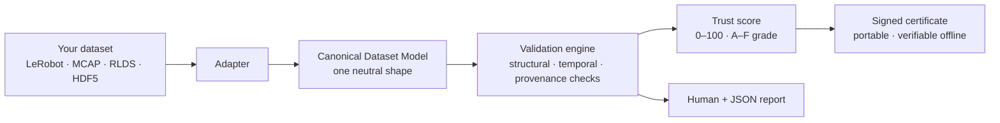
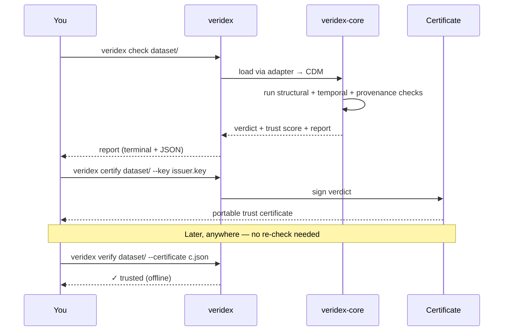

# Veridex

**Know if your robot data is safe to train on — in one command.**

Physical-AI teams lose weeks (and models) to bad data: mismatched clocks, corrupted episodes,
and datasets with no record of where they came from. As little as **0.3% poisoned data can
backdoor a policy**, and pooling the wrong data can make your model *worse*. Today there's no
fast, neutral way to check.

Veridex is that check. Point it at a dataset and it tells you — across any format — whether the
data is clean, correctly time-synchronized, and traceable to its origin, then stamps it with a
portable, signed **trust certificate** you can hand to anyone.

```sh
veridex check my-dataset/
```

```
Veridex Trust Report
  Score      82 / 100   (B)
  Structure  ✓ episodes intact, timestamps monotonic
  Temporal   ⚠ TEMPORAL.CLOCK_SKEW  camera vs. arm drift 41ms  → resync before training
  Provenance ⚠ missing sensor + license metadata on 3 streams
```

## Why it's useful

- **One command, any format.** LeRobot, MCAP, RLDS, HDF5/Zarr all map into one Canonical Dataset
  Model, so you check them the same way — no per-format tooling.
- **Catches the failures that quietly ruin training.** Clock skew across sensors, broken episode
  boundaries, timeline gaps, duplicate frames — each reported with the *training risk* it creates
  and a *remedy*.
- **Proves where data came from.** Which sensor, clock, calibration, annotator, license, and
  upstream dataset produced each segment — surfaced, scored, and emitted as a signed certificate
  (Croissant + W3C PROV underneath).
- **A number you can trust and share.** A deterministic 0–100 trust score and A–F grade. Same
  dataset always yields the same result, and the signed certificate verifies **offline**.
- **Never touches your data.** Veridex only reads and reports. It never mutates your dataset.

## Why it's different

Every major player — Hugging Face/LeRobot, Rerun, LanceDB, NVIDIA — is a *destination* that wants
your data in *their* format. None can be the neutral verifier *across* formats. Veridex takes the
one position an incumbent structurally can't: **Switzerland** — cross-format, and the only one that
also captures **provenance**.

## How it works



A single flow: whatever format your data arrives in, an **adapter** maps it into the Canonical
Dataset Model. The **validation engine** runs the same checks over that neutral shape, a **trust
score** summarizes the result, and a **signed certificate** makes it portable — anyone can verify
it later without re-running Veridex.



## Commands

```sh
veridex check      <dataset>                                      # validate + report
veridex certify    <dataset> --key issuer.key                     # issue a signed trust certificate
veridex verify     <dataset> --certificate c.json --key pub.key   # verify offline
veridex provenance <dataset> --emit croissant                     # extract + emit provenance
veridex inspect    <dataset>                                      # summarize the dataset
```

Built on a Rust core (`veridex-core`) with a `veridex` CLI and a Python package
(`pip install veridex-data`, then `import veridex`) that produce identical verdicts.

## Build & test

```sh
cargo build            # build the workspace
cargo test             # unit + property tests
cargo run -p veridex-cli -- --help
```

## Status

**Early implementation** — the core is landing against a full [OpenSpec](openspec/) design: the
Canonical Dataset Model, deterministic content hashing, the validation engine, the structural /
temporal / provenance check catalog, the v1 trust-score rubric, and terminal + JSON reporting are
in. Next up are the format adapters (LeRobot v3, MCAP) that populate the model from real files.

Start with [openspec/project.md](openspec/project.md) for the design, or track progress in
[openspec/changes/bootstrap-veridex-mvp/tasks.md](openspec/changes/bootstrap-veridex-mvp/tasks.md).

## Relationship to Invariant

Veridex is a separate product from [Invariant](https://github.com/clay-good/invariant), a runtime
command-validation firewall — different lifecycle stage (training-time vs. runtime), different
users. Veridex reuses Invariant's COSE/JWS signed-verdict and audit substrate rather than
reinventing it.

## License

MIT — see [LICENSE](LICENSE).
