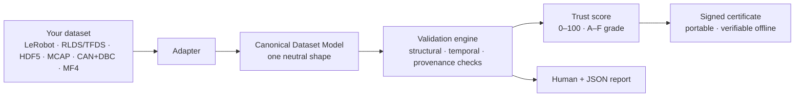
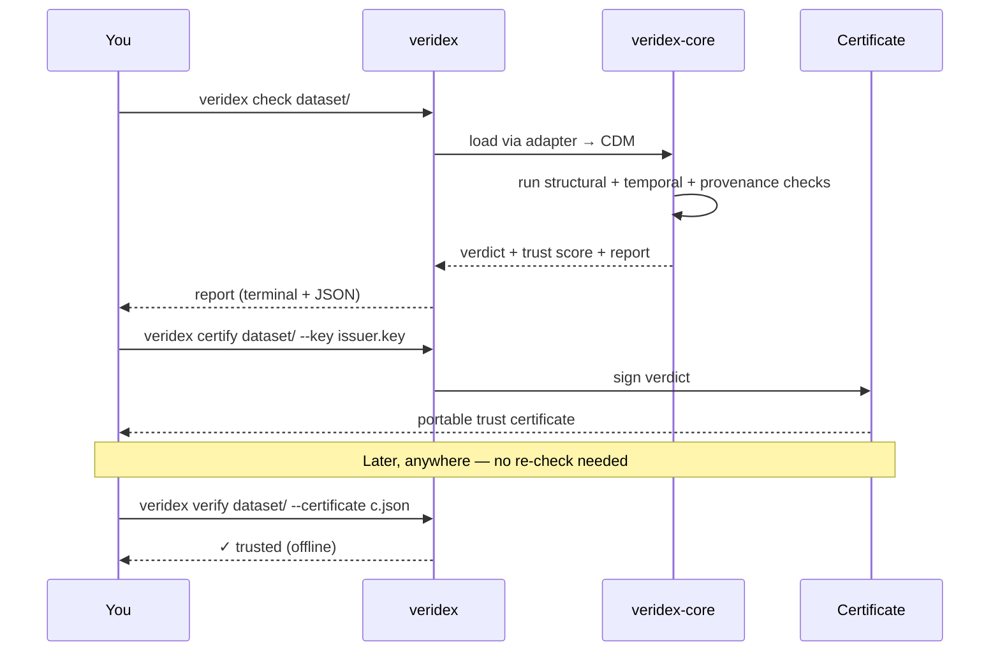

# Veridex

[](https://github.com/clay-good/veridex/actions/workflows/ci.yml)

**Know if your robot data is safe to train on — in one command.**

Physical-AI teams lose weeks (and models) to bad data: mismatched clocks, corrupted episodes,
and datasets with no record of where they came from. As little as **0.3% poisoned data can
backdoor a policy**, and pooling the wrong data can make your model *worse*. Today there's no
fast, neutral way to check.

Veridex is that check. Point it at a dataset and it tells you — across any format — whether the
data is clean, correctly time-synchronized, and traceable to its origin, then stamps it with a
portable, signed **trust certificate** you can hand to anyone.

```sh
veridex check my-dataset/
```

An illustrative summary of what a run tells you (the real terminal report lists each finding with
its risk and remedy, worst episodes first):

```
Veridex Trust Report
  Score      82 / 100   (B)
  Structure  ✓ episodes intact, timestamps monotonic
  Temporal   ⚠ TEMPORAL.CLOCK_SKEW  camera vs. arm drift 41ms  → resync before training
  Provenance ⚠ missing sensor + license metadata
```

## Why it's useful

- **One command, any format.** LeRobot v3, RLDS/TFDS (what Open X-Embodiment ships in), HDF5 (what
  robomimic and most lab collectors write), MCAP, CAN+DBC, and ASAM MDF/MF4 all map into one
  Canonical Dataset Model, so you check them the same way — no per-format tooling. Zarr is on the
  roadmap.
- **Catches the failures that quietly ruin training.** Clock skew across sensors, broken episode
  boundaries, timeline gaps, duplicate frames, a video whose frame count no longer matches the
  actions it is paired with — each reported with the *training risk* it creates and a *remedy*.
- **Proves where data came from.** Which sensor, clock, calibration, annotator, license, and
  upstream dataset produced each segment — surfaced, scored, and emitted as a signed certificate
  (Croissant + W3C PROV underneath).
- **A number you can trust and share.** A deterministic 0–100 trust score and A–F grade. Same
  dataset and the same Veridex version always yield the same result, and the signed certificate
  verifies **offline**.
- **Never touches your data.** Veridex only reads and reports. It never mutates your dataset.

## Why it's different

Every major player — Hugging Face/LeRobot, Rerun, LanceDB, NVIDIA — is a *destination* that wants
your data in *their* format. None can be the neutral verifier *across* formats. Veridex takes the
one position an incumbent structurally can't: **Switzerland** — cross-format, and the only one that
also captures **provenance**.

## How it works



A single flow: whatever format your data arrives in, an **adapter** maps it into the Canonical
Dataset Model. The **validation engine** runs the same checks over that neutral shape, a **trust
score** summarizes the result, and a **signed certificate** makes it portable — anyone can verify
it later without re-running Veridex. Every check and the findings it can emit are cataloged in
[docs/checks.md](docs/checks.md). Working with an autonomy sensor rig? Start with the
[autonomy quickstart](docs/autonomy-quickstart.md).



## Commands

```sh
veridex check      <dataset> [--sample-episodes <n> | --sample-fraction <f>]  # validate + report
veridex certify    <dataset> --key issuer.key [--profile world-model-ready]  # issue a signed trust certificate
veridex verify     <dataset> --certificate c.json --key pub.key   # verify offline (issuer required)
veridex provenance <dataset> --emit croissant                     # extract + emit provenance
veridex inspect    <dataset>                                      # summarize the dataset
veridex checks                                                    # list the built-in check catalog
veridex diff       <old.json> <new.json>                         # diff two report JSONs
veridex keygen     issuer                                        # write issuer (secret) + issuer.pub
```

Built on a Rust core (`veridex-core`) with a `veridex` CLI and a Python package (`import veridex`,
built locally with maturin — not yet published to PyPI) that produce identical verdicts. Pass a
config to Python explicitly (`veridex.check(path, config=open("veridex.toml").read())`) — unlike the
CLI, an import never picks one up from the working directory.

## Quickstart

```sh
cargo build

# generate a demo MCAP with a synthetic cross-stream clock skew (append `clean`,
# `late-start`, or `stuck` for a clean recording, a late sensor, or a frozen camera)
cargo run -p veridex-core --example make_demo_mcap -- /tmp/demo.mcap

# validate it — prints a report and exits non-zero on failure
cargo run -p veridex-cli -- check /tmp/demo.mcap

# summarize the Canonical Dataset Model (structure + provenance coverage)
cargo run -p veridex-cli -- inspect /tmp/demo.mcap

# machine-readable output
cargo run -p veridex-cli -- check --json /tmp/demo.mcap

# issue a signed, content-bound trust certificate and verify it offline
cargo run -p veridex-cli -- keygen /tmp/issuer
cargo run -p veridex-cli -- certify /tmp/demo.mcap --key /tmp/issuer --out /tmp/demo.veridex.json
cargo run -p veridex-cli -- verify  /tmp/demo.mcap --certificate /tmp/demo.veridex.json --key /tmp/issuer.pub
```

`check` catches the headline `TEMPORAL.CLOCK_SKEW` (the camera and robot clocks drift 210 ms apart,
which also diverges their tails as `TEMPORAL.END_OFFSET`), reports the training risk and remedy, and
exits `20` (fail). The `late-start` variant instead trips `TEMPORAL.START_OFFSET` — a sensor that
came online late on the shared clock — and the `stuck` variant a frozen camera whose byte-identical
frames trip `STRUCTURAL.STUCK_STREAM`, a freeze the timestamp checks can't see. Exit codes: `0` pass · `10`
pass-with-warnings · `20` fail · `2` tool-error. For CI you can gate on severity (`--fail-on
warning`) or on the trust score directly (`--min-score 80` fails when the score is below 80).

Drop a [`veridex.toml`](docs/veridex.toml.example) in your repo (or pass `--config`) to select
categories, disable checks, override per-check severities, tune numeric tolerances (clock-skew,
rate, gap, jitter, start-offset, end-offset, episode-duration, saturation, outlier sigma, rig
sequence-drop, ego max speed), and set the failure
threshold — the effective config is recorded in every
verdict, and unknown keys, check ids, or invalid tolerances are rejected, not silently ignored.

Veridex reads untrusted files, so ingestion carries two budgets. A **frame budget** (20M by default):
a dataset that would materialize more frames is refused with a clear error rather than exhausting
memory, because the frame count is a product of two numbers the file itself controls. And a
**decompression budget** for compressed containers (MCAP chunks and LeRobot Parquet), capping
expansion at 100x the file's own size with a 64 MiB floor — so a small file cannot unpack into a
gigabyte, while a genuinely large log keeps a proportionate allowance. Raise either with `--max-frames <n>` /
`--max-decompression-ratio <n>`, or remove it with `0`.

For a dataset too large to check in full on every commit, `check` and `inspect` can validate a subset
of its episodes:

```sh
veridex check my-dataset/ --sample-episodes 20             # the first 20 episodes by index
veridex check my-dataset/ --sample-fraction 0.1 --sample-seed 7   # a deterministic 10% draw
```

The draw is resolved from the dataset's declared episode set *before* any data is read, so the
episodes you skipped cost nothing — a sample of a dataset over the frame budget succeeds where the
full ingest is refused. The same seed always draws the same episodes. Sampling applies to LeRobot,
RLDS/TFDS, and HDF5 (which have an episode axis); MCAP, CAN+DBC, and MF4 ingest a recording as one episode and refuse the request rather than handing
back everything labelled as a sample.

A sampled run is never presented as a whole-dataset one. The verdict carries a `coverage` field
(bound into its hash), every report states the sample and the episode count, and **`certify` refuses
to issue a certificate from a partial run** — a certificate speaks for a dataset, and the episodes a
sample never read are exactly where the problem would be.

The same command works on a LeRobot v3 dataset — proof of the cross-format claim. Generate a demo
one (its second episode carries an out-of-order timestamp) and check it the same way:

```sh
# generate a demo LeRobot v3 dataset; append `clean`, `truncated`, `boundary`, `jitter`,
# `short-episode`, `duplicate`, `saturated`, `spike`, `nan`, `multi-joint`, `video`,
# `video-desync`, `video-missing`, or `video-reencoded`
cargo run -p veridex-core --example make_demo_lerobot -- /tmp/demo-lerobot
cargo run -p veridex-cli -- check /tmp/demo-lerobot   # fires TEMPORAL.NON_MONOTONIC, exits 20
```

The `truncated` variant writes a dataset whose manifest declares more frames than were exported —
a realistic interrupted upload — and `check` catches it as `STRUCTURAL.FRAME_COUNT_MISMATCH`. The
`boundary` variant leaves the frames intact but corrupts one episode's declared `length` in
`meta/episodes.jsonl` — the lerobot#4143 failure, where wrong cumulative boundaries silently load
frames under the wrong episode — and `check` catches the declared-vs-actual disagreement as
`STRUCTURAL.EPISODE_BOUNDARY`. The
`jitter` variant spaces one episode's frames unevenly so its mean rate still looks right, and
`check` flags the irregular timeline as `TEMPORAL.JITTER`. The `short-episode` variant records five
episodes where one was cut short right after it began, and `check` flags it against the dataset
median as `TEMPORAL.EPISODE_DURATION_OUTLIER`. The `duplicate` variant re-uploads an episode
byte-for-byte, and `check` catches it as `STRUCTURAL.DUPLICATE_EPISODE` — Veridex fingerprints each
feature cell's bytes into a per-frame content hash, so the duplicate is proven by content, not
guessed from matching timestamps. The `saturated` variant pins the feature values exactly at their
maximum for most of the episode — a clamped actuator against its stop — and `check` flags it as
`STATISTICAL.SATURATED` from the values it recomputes as it fingerprints them. The `spike` variant
jumps a single frame far off the baseline — a sensor glitch or unit error — and `check` flags it as
`STATISTICAL.OUTLIER`, provably a rare value by Chebyshev's inequality. The `nan` variant writes one
NaN feature value and no `meta/stats.json`, so the stored-stats check has nothing to inspect — only
the recompute over the real cells sees it, flagged as `STATISTICAL.NON_FINITE_OBSERVED`. The
`multi-joint` variant is a 3-DoF `action` whose gripper (dimension 2) saturates while the arm joints
sweep freely; `check` flags `STATISTICAL.SATURATED` and **names the dimension** — the value-based
checks scan every joint, not just element 0, which is where real robot data hides its problems. Every
variant also ships a Hugging Face-style dataset card (`README.md`), so `veridex inspect` surfaces the
extracted `license` as covered provenance rather than a `PROVENANCE.MISSING_LICENSE` gap.

Four more variants add a real camera feature backed by `.mp4` files, because a video dataset is two
artifacts that nothing reconciles — a manifest and a data table on one side, a container on the
other, paired by frame index and never checked against each other. `video` is the clean baseline;
`video-desync` gives episode 1 a video three frames short of its rows (`VIDEO.FRAME_COUNT_MISMATCH`
— every pair past the shorter one is an action against an image from a different moment);
`video-missing` never uploads that file (`VIDEO.MEDIA_MISSING`); and `video-reencoded` ships 320x240
video against a declared 640x480 (`VIDEO.RESOLUTION_MISMATCH`, charged once for the stream rather
than once per episode). Veridex reads the container's **headers only** — it never decodes a pixel —
and it compares the codec across the names for one encoder, so a manifest saying `h264` against a
container stamped `avc1` is not reported as a mismatch.

It works on an **RLDS/TFDS** dataset too — the layout Open X-Embodiment and most TFDS-published
robot datasets ship in, and the third format behind the same command:

```sh
# generate a demo RLDS dataset in the TFDS layout; append `truncated`, `desynced`, or `corrupt`
cargo run -p veridex-core --example make_demo_rlds -- /tmp/demo-rlds
cargo run -p veridex-cli -- check /tmp/demo-rlds
```

RLDS stores one episode per TFRecord, with every step's values concatenated into a single
`tf.train.Example` — so an episode's step count is never written down, it is *derived* by dividing
each feature's list length by the element size `features.json` declares. Veridex does that division
for every step feature and requires the answers to agree. The `desynced` variant makes them
disagree (19 camera images against 20 actions) and is refused by name, rather than mapped into a
19-step episode that would read as sound. The `truncated` variant declares four episodes in its
shard lengths and ships three (`STRUCTURAL.EPISODE_COUNT_MISMATCH`), and `corrupt` flips one bit
inside a record — only the TFRecord CRC-32C notices, and Veridex verifies it on every record rather
than parsing past it.

One honesty note this format forces: **RLDS records no wall clock.** There is no per-step timestamp
in it, so Veridex stamps frames with their step index, records in the CDM that those timestamps are
an index rather than measured time, and never invents a rate. The checks that need measured time —
rate, gap, jitter, clock skew, start/end offset, episode duration — then skip those streams instead
of grading a dataset against a period Veridex made up.

They *say* they skipped, which is the part that matters. A step index is flawlessly monotonic,
perfectly regular, and identical across every stream of an episode, so a check that graded it would
pass — and a clean temporal result is exactly what a report and a signed certificate carry forward,
where it reads as "these sensors were synchronized." So a run over such a dataset emits
`TEMPORAL.UNMEASURED_CLOCK`, and it travels: into the JSON, the SARIF, the HTML, and the
certificate's findings summary. A passing verdict on an RLDS dataset means the structure and the
content are sound, and that nobody measured the timing.

It works on an **HDF5** file too — what `robomimic`, MimicGen, RoboTurk, and most hand-rolled lab
collectors write, and the fourth format behind the same command:

```sh
# a real h5py-written robomimic-layout file, committed as a test fixture
cargo run -p veridex-cli -- check crates/veridex-core/tests/fixtures/hdf5/robomimic_small.h5
```

The mapping is the file's own structure: a **group of arrays is an episode** (`/data/demo_0`), every
array under it is a **stream** (`actions`, `obs/agentview_image`, nested paths included), and an
array's first dimension is that stream's frame count. Types and shapes come from the file — a
`float32 [T, 7]` action stream stays exactly that — and the attributes a collector writes become
metadata, provenance, and the counts a check can test against (`num_samples` per episode, `/data`'s
`total` frames). Values are read, so the statistical checks are live: a gripper pinned at its limit,
a NaN buried in joint 6, or a lone 250x spike is caught **per dimension** and named. Veridex reads the HDF5 container directly, with no libhdf5 dependency: superblocks
v0–v3, old- and new-style groups, contiguous, compact, and chunked storage, and the `deflate`,
`shuffle`, and `fletcher32` filters. A structure it does not read is named rather than skipped past.

HDF5 records no clock either, so the same honesty rule applies: frames carry a step index, and the
temporal checks abstain and say so. A file that *does* record time gets measured time — but only if
it also declares its units (a `units` attribute on the timestamp array). Whether a bare `time`
column is seconds or nanoseconds is not something Veridex will guess: guess wrong and every rate,
duration, and skew verdict derived from it is fiction.

The certificate binds to the dataset's CDM content hash and is Ed25519-signed: `verify` succeeds
offline, and rejects a tampered certificate (signature mismatch) or one presented against a
different dataset (content-hash mismatch). **`verify` requires a trusted issuer key**: a valid
signature only proves a certificate is self-consistent, and anyone can mint one about data they
hold — so you either name the issuer with `--key`, or say `--allow-any-issuer` and get a printed
warning (and `issuer_verified: false` in `--json`) instead of an implied endorsement.
On success `verify` reports what the certificate actually
attests — the hash it is bound to, the trust score, and, for a certificate issued with
`--profile world-model-ready`, each readiness criterion's verdict (`--json` for the machine-readable
form). Every line printed is covered by the signature that just verified, so a doctored readiness
block fails verification rather than being read back.

## Python

The same core is available from Python (build it locally with maturin — see below; `veridex-data`
is not yet published to PyPI), with
verdicts identical to the CLI:

```python
import veridex, json
report = json.loads(veridex.check("my-dataset.mcap"))
print(report["trust_score"]["grade"], report["verdict"]["status"])

# the same sampling the CLI offers; the report carries coverage: {"kind": "sample", ...}
sampled = json.loads(veridex.check("my-dataset/", sample_fraction=0.1, sample_seed=7))
print(sampled["verdict"]["coverage"])
```

Build the extension locally with [maturin](https://github.com/PyO3/maturin):
`maturin develop -m crates/veridex-py/Cargo.toml`.

## Build & test

```sh
cargo build            # build the workspace
cargo test             # unit + property + integration tests
cargo clippy --all-targets
```

## Status

**Early implementation, runs end-to-end.** Against a full [OpenSpec](openspec/) design, these are
in and tested: the Canonical Dataset Model with deterministic content hashing; the validation
engine; the structural / temporal / statistical / semantic / **video** / provenance / **autonomy** check catalog
(including the headline `TEMPORAL.CLOCK_SKEW`, cross-episode dtype/shape consistency, and the
sensor-rig checks `AUTONOMY.RIG_SYNC` / `SEQUENCE_COMPLETE` / `EGO_POSE_CONTINUITY` /
`CALIBRATION_INCOMPLETE` / `SENSOR_FRAME_UNKNOWN` / `SENSOR_FRAME_UNRELATED` — the last two catch the
LiDAR-camera miscalibration a well-formed transform tree hides, where a sensor's own frame is absent
from the tree or has no chain of transforms to the camera); **video/media checks** that read an
`.mp4`'s container headers (never a pixel) and catch the missing, unparseable, desynced, or
re-encoded video behind a camera stream; the v1 trust-score rubric and the `world-model-ready` readiness profile;
terminal, JSON, SARIF 2.1.0, and self-contained HTML reporting; **LeRobot v3, RLDS/TFDS, HDF5, MCAP (with
ROS-message decode into an autonomy rig), CAN+DBC, and ASAM MDF/MF4 adapters** with a passing cross-format
neutrality gate (the same logical dataset yields equivalent CDMs as LeRobot v3 and as MCAP); descriptive scenario-dimension coverage and **scenario/map/sim
reference extraction** (OpenSCENARIO / OpenDRIVE / OSI / simulator, with the version read from the
referenced sidecar's own ASAM header); Croissant + W3C PROV provenance emit; Ed25519 **certificate signing with
offline verification** (tamper + transplant rejection); a working CLI (`check`, `inspect`, `checks`,
`certify`, `verify`, `provenance`, `keygen`, `diff`) — see the [Quickstart](#quickstart); and **Python
bindings** (`import veridex`, exposing `check`/`check_sarif`/`check_html`/`inspect`/`content_hash`/`catalog`/`provenance`/`diff`/`keygen`/`certify`/`verify`/`version`) that call the same
core pipeline, with a CLI⇄Python parity test run in CI; and **sampled ingestion** (`--sample-episodes`
/ `--sample-fraction`), resolved before any data is read and reported as partial coverage everywhere
it could otherwise be mistaken for a full check. Next up: streaming/remote ingestion — until then
`metadata_only` and a remote source are refused with a clear error, never silently ignored.

What Veridex does **not** tell you, stated plainly because silence would read as a pass: it never
decodes a pixel or a point, so it says nothing about the *content* of your imagery — no PII or face
detection, and no near-duplicate detection beyond exact content matches. Both limits, and every
check's own abstention rules, are recorded in [docs/checks.md](docs/checks.md).

Start with [openspec/project.md](openspec/project.md) for the design, or track progress in
[openspec/changes/bootstrap-veridex-mvp/tasks.md](openspec/changes/bootstrap-veridex-mvp/tasks.md).

## Relationship to Invariant

Veridex is a separate product from [Invariant](https://github.com/clay-good/invariant), a runtime
command-validation firewall — different lifecycle stage (training-time vs. runtime), different
users. Veridex reuses Invariant's COSE/JWS signed-verdict and audit substrate rather than
reinventing it.

## License

MIT — see [LICENSE](LICENSE).
