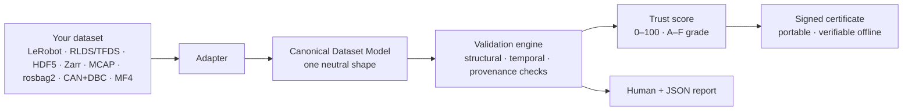
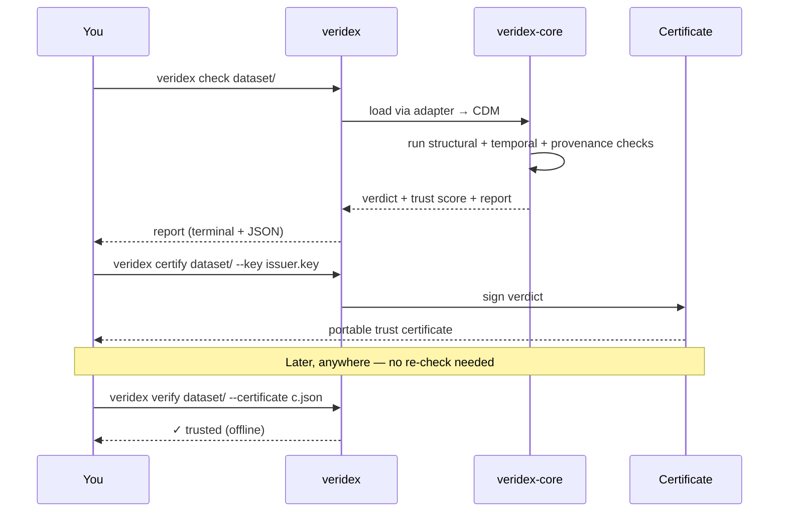

# Veridex

[](https://github.com/clay-good/veridex/actions/workflows/ci.yml)

**Know if your robot data is safe to train on — in one command.**

Physical-AI teams lose weeks (and models) to bad data: mismatched clocks, corrupted episodes,
and datasets with no record of where they came from. As little as **0.3% poisoned data can
backdoor a policy**, and pooling the wrong data can make your model *worse*. Today there's no
fast, neutral way to check.

Veridex is that check. Point it at a dataset and it tells you — across any format — whether the
data is clean, correctly time-synchronized, and traceable to its origin, then stamps it with a
portable, signed **trust certificate** you can hand to anyone.

```sh
veridex check my-dataset/
```

An illustrative summary of what a run tells you (the real terminal report lists every finding with
its location and message, worst episodes first, and the risk and remedy for anything at warning or
error — `--full` adds those for the informational ones too):

```
Veridex Trust Report
  Score      82 / 100   (B)
  Structure  ✓ episodes intact, timestamps monotonic
  Temporal   ⚠ TEMPORAL.CLOCK_SKEW  camera vs. arm drift 41ms  → resync before training
  Provenance ⚠ missing sensor + license metadata
```

## Why it's useful

- **One command, any format.** LeRobot v3, RLDS/TFDS (what Open X-Embodiment ships in), HDF5 (what
  robomimic and most lab collectors write), Zarr (what Diffusion Policy and UMI ship in), MCAP,
  ROS 2 rosbag2 (`.db3` — what a ROS 2 robot records by default), CAN+DBC, and ASAM MDF/MF4 all map
  into one Canonical Dataset Model, so you check them the same way — no per-format tooling.
- **Catches the failures that quietly ruin training.** Clock skew across sensors, broken episode
  boundaries, timeline gaps, duplicate frames, a video whose frame count no longer matches the
  actions it is paired with — each reported with the *training risk* it creates and a *remedy*.
- **Proves where data came from.** Which sensor, clock, calibration, annotator, license, and
  upstream dataset produced each segment — surfaced, scored, and emitted two ways: as a signed
  trust certificate, and as Croissant + W3C PROV documents (`veridex provenance --emit`) for tools
  that speak them. The Croissant carries what Veridex actually extracted — name, license, creator,
  the CDM hash, and every provenance element with its class — and deliberately omits `datePublished`,
  `url` and `version`, which it has no honest value for. A Croissant validator warns about exactly
  those three; it will not warn about anything Veridex made up.
- **A number you can trust and share.** A deterministic 0–100 trust score and A–F grade. Same
  dataset and the same Veridex version always yield the same result — including from inside the
  dataset directory, so a certificate issued anywhere verifies anywhere — and the signed certificate
  verifies **offline**.
- **Never touches your data.** Veridex only reads and reports. It never mutates your dataset: if
  `certify` would default its output into the dataset directory (running it from *inside* one), it
  refuses and asks for `--out` rather than writing there.

## Why it's different

Every major player — Hugging Face/LeRobot, Rerun, LanceDB, NVIDIA — is a *destination* that wants
your data in *their* format. None can be the neutral verifier *across* formats. Veridex takes the
one position an incumbent structurally can't: **Switzerland** — cross-format, and the only one that
also captures **provenance**.

## How it works



A single flow: whatever format your data arrives in, an **adapter** maps it into the Canonical
Dataset Model. The **validation engine** runs the same checks over that neutral shape, a **trust
score** summarizes the result, and a **signed certificate** makes it portable — anyone can verify
it later without re-running Veridex. Every check and the findings it can emit are cataloged in
[docs/checks.md](docs/checks.md). Working with an autonomy sensor rig? Start with the
[autonomy quickstart](docs/autonomy-quickstart.md).



## Commands

```sh
veridex check      <dataset> [--json | --sarif | --html] [--sample-episodes <n> | --sample-fraction <f> | --metadata-only]  # validate + report
veridex check      --print-config [--config f.toml] [--profile p]  # print the effective config
veridex check      <dataset> --redact                             # a report you can share
veridex check      <dataset> --sarif --out veridex.sarif          # write the report to a file
veridex certify    <dataset> --key issuer.key [--profile world-model-ready]  # issue a signed trust certificate
veridex verify     <dataset> --certificate c.json --key pub.key   # verify offline (issuer required)
veridex provenance <dataset> --emit croissant                     # extract + emit provenance
veridex inspect    <dataset>                                      # summarize the dataset
veridex checks                                                    # list the built-in check catalog
veridex diff       <old.json> <new.json>                         # diff two report JSONs
veridex watch      <dataset> [--interval <secs>] [--iterations <n>]  # re-validate as it records
veridex attest     <dataset> --key producer.key --set clock=ptp   # sign provenance you can vouch for
veridex label      --certificate c.json --key pub.key            # a Markdown label for a dataset card
veridex keygen     issuer                                        # write issuer (secret) + issuer.pub
```

Built on a Rust core (`veridex-core`) with a `veridex` CLI and a Python package (`import veridex`,
built locally with maturin — not yet published to PyPI) that produce identical verdicts. Pass a
config to Python explicitly (`veridex.check(path, config=open("veridex.toml").read())`) — unlike the
CLI, an import never picks one up from the working directory.

## Quickstart

```sh
cargo build

# generate a demo MCAP with a synthetic cross-stream clock skew (append `clean`, `late-start`,
# `stuck`, `av`, or `av-miscalibrated`; an unknown variant is refused, never silently substituted)
cargo run -p veridex-core --example make_demo_mcap -- /tmp/demo.mcap

# validate it — prints a report and exits non-zero on failure
cargo run -p veridex-cli -- check /tmp/demo.mcap

# summarize the Canonical Dataset Model (structure + provenance coverage)
cargo run -p veridex-cli -- inspect /tmp/demo.mcap

# machine-readable output
cargo run -p veridex-cli -- check --json /tmp/demo.mcap

# re-validate a dataset while it is still being recorded (Ctrl-C to stop)
cargo run -p veridex-cli -- watch /tmp/demo.mcap --interval 2

# issue a signed, content-bound trust certificate and verify it offline
cargo run -p veridex-cli -- keygen /tmp/issuer
cargo run -p veridex-cli -- certify /tmp/demo.mcap --key /tmp/issuer --out /tmp/demo.veridex.json
cargo run -p veridex-cli -- verify  /tmp/demo.mcap --certificate /tmp/demo.veridex.json --key /tmp/issuer.pub
```

`check` catches the headline `TEMPORAL.CLOCK_SKEW` (the camera and robot clocks drift 210 ms apart,
which also diverges their tails as `TEMPORAL.END_OFFSET`), reports the training risk and remedy, and
exits `20` (fail). The `late-start` variant instead trips `TEMPORAL.START_OFFSET` — a sensor that
came online late on the shared clock — and the `stuck` variant a frozen camera whose byte-identical
frames trip `STRUCTURAL.STUCK_STREAM`, a freeze the timestamp checks can't see. Exit codes: `0` pass · `10`
pass-with-warnings · `20` fail · `2` tool-error. For CI you can gate on severity (`--fail-on
warning`) or on the trust score directly (`--min-score 80` fails when the score is below 80). A score
gate is a claim about the whole dataset, so it is **refused outright** — loudly, with exit `2` —
over any run that cannot support that claim: `--metadata-only`, a `--sample-episodes` /
`--sample-fraction` run (the episodes it skipped are where the defect would be), or a run narrowed
by config (checks deselected, a severity overridden, or a tolerance *loosened*). The data score starts at
100 and only deducts, so anything that stops a check from measuring *raises* it — each of those is
otherwise one flag away from a green gate on bad data. A profile is not a narrowing and does not
block the gate — `--profile strict` measures at tighter thresholds across the temporal and
statistical families, and `--profile standard` names the defaults so a pipeline records which policy
it ran under. There is deliberately no `lenient`: a profile may only *tighten* a threshold, which measures the data harder than the catalog
asks, so `check --profile world-model-ready --min-score 80` is a valid CI gate. `check --profile
world-model-ready` also prints the per-criterion readiness verdict it judged against; `certify` is
what signs it.

Configuration comes in layers: built-in defaults, then a `veridex.toml`, then the `VERIDEX_*`
environment, then command-line flags — each overriding the last. Every config key has one
environment twin (`VERIDEX_MIN_SCORE`, `VERIDEX_CATEGORIES`, `VERIDEX_TOLERANCE_CLOCK_SKEW_MS`,
`VERIDEX_CONFIG`, `VERIDEX_PROFILE`, …; see [`docs/veridex.toml.example`](docs/veridex.toml.example)),
so a container or CI job can configure a run without writing a file. Values from the environment are
validated exactly as file values are: an out-of-range tolerance, an unknown category, or a
`VERIDEX_TOLERANCE_*` name matching no key is an error, never a setting that quietly does nothing.

`veridex check --print-config` prints the configuration a run would use — every setting's value and
**the layer that set it**: built-in default, `veridex.toml`, environment, policy profile, or flag,
with a note where one overrode another — a `clock_skew_ms` of 20 prints as coming from the profile,
which tightened it from the 50 the file asked for. It reads no dataset, and it validates the config exactly
as a run would, so it is also the cheapest way to check a `veridex.toml` before pointing it at data.
`--json` emits the same document as `veridex.config/1`.

Every report — terminal, JSON, and HTML — now leads with rollups: findings **by category**, the
**worst episodes**, and the **worst streams** (a camera that drifts in forty episodes is one entry,
not forty). `--json` carries the same summaries under `rollups`, so a CI job no longer has to
re-derive from the finding list what the human report was handed.

`--redact` prepares a report to **leave the building**. The dataset identifier, stream names, task
and label text, and provenance values are replaced with stable placeholders (`stream#1`, `text#2`),
consistent within one report and meaningless outside it, and the report says so — as a finding, so
the disclosure travels into JSON, SARIF and HTML too. Every measurement stays: a 210 ms drift, a 12σ
outlier, the score, the status, and the CDM content hash, which is what lets whoever holds the data
match the report to it. `certify` refuses it: a certificate attests a dataset by name and hash. So does `diff` — comparing a
redacted report with a plain one compares documents, not runs, and `--fail-on-regression` treats that
mismatch as a regression.

`watch` runs that same check on a **dataset that is still being recorded**. Each tick it fingerprints
the dataset's files (names, sizes, modification times — nothing is opened, and a symlink out of the
dataset is never followed), and re-validates only when something moved. The first pass prints the
full report; after that it prints just what changed — findings introduced, findings resolved, and how
the trust score moved — so a long recording stays readable. A half-written shard is an ordinary
moment in a recording, not a reason to quit: the read error is printed and the watch continues. Bound
it with `--iterations <n>` to make it a CI step (the exit code is the last completed validation's,
under the same `--fail-on` threshold as `check`), or use `--json` for one JSON document per line as
the recording proceeds. Like every other command, it only reads: nothing is written to the dataset.

Most of what provenance means is not in the file — no format records who operated the robot, which
calibration was in force, or what upstream a merge drew from — and Veridex will not infer any of it.
`veridex attest` lets the producer **sign for it**, bound to the dataset's content hash and signed
with their own key; `check --attestation` and `certify --attestation` apply what verifies, raising
provenance coverage and saying in the report that a signature — not the data — is why. Nothing
attested enters the CDM, so the content hash still describes the data and nothing else. See
[docs/trust-chain.md](docs/trust-chain.md).

`veridex label` renders a certificate as the form a person actually meets it in: a compact Markdown
**trust label** — grade, score, findings by family, provenance coverage, the bound hash, who issued
it — to paste into a dataset card or a PR. It renders only from a certificate that verifies, and a
label made without a trusted issuer key says so *in the label*, because that caveat has to survive
being pasted somewhere else.

Running it in CI: [docs/ci-recipes.md](docs/ci-recipes.md) has the GitHub Actions and GitLab
recipes, including uploading `--sarif` to the Security tab and gating on a *regression* rather than
on pre-existing findings.

Drop a [`veridex.toml`](docs/veridex.toml.example) in your repo (or pass `--config`) to select
categories, disable checks, override per-check severities, tune numeric tolerances (clock-skew,
rate, gap, jitter, start-offset, end-offset, episode-duration, saturation, outlier sigma, rig
sequence-drop, ego max speed), and set the failure
threshold — the effective config is recorded in every
verdict, and unknown keys, check ids, or invalid tolerances are rejected, not silently ignored.


## Going further

| If you want to | Read |
| --- | --- |
| See it read LeRobot, RLDS/TFDS, HDF5, Zarr, MCAP, rosbag2, CAN+DBC, MF4 | [docs/formats.md](docs/formats.md) |
| Sign, verify, and share a verdict — including producer attestation | [docs/trust-chain.md](docs/trust-chain.md) |
| Check a dataset too large to read in full, and what that costs | [docs/partial-runs.md](docs/partial-runs.md) |
| Run it in CI (GitHub Actions, GitLab, SARIF upload, regression gating) | [docs/ci-recipes.md](docs/ci-recipes.md) |
| Know exactly what each check looks for | [docs/checks.md](docs/checks.md) |
| Judge a rig against a policy profile | [docs/profiles.md](docs/profiles.md) |
| Understand the 0–100 score | [docs/rubric-v1.md](docs/rubric-v1.md) |
| Configure it | [docs/veridex.toml.example](docs/veridex.toml.example) |

## Python

The same core is available from Python (build it locally with maturin — see below; `veridex-data`
is not yet published to PyPI), with
verdicts identical to the CLI:

```python
import veridex, json
report = json.loads(veridex.check("my-dataset.mcap"))
print(report["trust_score"]["grade"], report["verdict"]["status"])

# the same sampling the CLI offers; the report carries coverage: {"kind": "sample", ...}
sampled = json.loads(veridex.check("my-dataset/", sample_fraction=0.1, sample_seed=7))
print(sampled["verdict"]["coverage"])

# and the same manifest-only check; coverage: {"kind": "metadata_only", ...}
manifest = json.loads(veridex.check("my-dataset/", metadata_only=True))
print(manifest["verdict"]["coverage"])
```

Python mirrors the CLI's *operations* — `check`, `certify`, `verify`, `provenance`, `inspect`, `diff`,
`effective_config`, `label`, `attest`.
`watch` is not among them by design: it is a loop around `check`, not an operation, and a Python
caller already owns their own loop.

Build the extension locally with [maturin](https://github.com/PyO3/maturin):
`maturin develop -m crates/veridex-py/Cargo.toml`.

## Releasing

`veridex-core` and `veridex-cli` publish to crates.io and `veridex-data` to PyPI, in that order —
each depends on the one before it. The checklist, the ordering constraint, and what the published
crate excludes are in [docs/releasing.md](docs/releasing.md). Nothing has shipped yet; v0.1.0 is the
first.

## Build & test

```sh
cargo build            # build the workspace
cargo test             # unit + property + integration tests
cargo clippy --all-targets
```

## Status

**Early implementation, runs end-to-end.** Against a full [OpenSpec](openspec/) design, these are
in and tested: the Canonical Dataset Model with deterministic content hashing; the validation
engine; the structural / temporal / statistical / semantic / **video** / provenance / **autonomy** check catalog
(including the headline `TEMPORAL.CLOCK_SKEW`, cross-episode dtype/shape consistency, and the
sensor-rig checks `AUTONOMY.RIG_SYNC` / `SEQUENCE_COMPLETE` / `EGO_POSE_CONTINUITY` /
`CALIBRATION_INCOMPLETE` / `SENSOR_FRAME_UNKNOWN` / `SENSOR_FRAME_UNRELATED` — the last two catch the
LiDAR-camera miscalibration a well-formed transform tree hides, where a sensor's own frame is absent
from the tree or has no chain of transforms to the camera); **video/media checks** that read an
`.mp4`'s container headers (never a pixel) and catch the missing, unparseable, desynced, or
re-encoded video behind a camera stream; the v1 trust-score rubric, the `standard` / `strict` threshold profiles and the `world-model-ready`
readiness profile;
terminal, JSON, SARIF 2.1.0, and self-contained HTML reporting, each carrying rollups by category,
episode and stream, and each shareable through `--redact`; **LeRobot v3, RLDS/TFDS, HDF5, Zarr, MCAP and ROS 2 rosbag2 (both with
ROS-message decode into an autonomy rig; rosbag2 reads the `sqlite3` storage plugin through Veridex's
own bounds-checked SQLite reader, reconciles the bag against its `metadata.yaml` message total, and
discloses a message on an undeclared topic as unread rather than dropping it), CAN+DBC, and ASAM
MDF/MF4 adapters** with a passing cross-format
neutrality gate (the same logical dataset yields equivalent CDMs as LeRobot v3 and as MCAP); descriptive scenario-dimension coverage and **scenario/map/sim
reference extraction** (OpenSCENARIO / OpenDRIVE / OSI / simulator, with the version read from the
referenced sidecar's own ASAM header); Croissant + W3C PROV provenance emit (carrying attested provenance when one is
applied); Ed25519 **certificate signing with offline verification** (tamper + transplant rejection)
and **producer attestation** — provenance a producer signs for, bound to the dataset's content hash
and disclosed by the key that signed it; a working CLI (`check`, `inspect`, `checks`,
`certify`, `verify`, `provenance`, `keygen`, `diff`, `watch`, `label`, `attest`,
`check --print-config`, `check --redact`) — see the [Quickstart](#quickstart); and **Python
bindings** (`import veridex`, exposing `check`/`check_sarif`/`check_html`/`inspect`/`content_hash`/`catalog`/`provenance`/`diff`/`keygen`/`certify`/`verify`/`effective_config`/`label`/`attest`/`version`) that call the same
core pipeline, with a CLI⇄Python parity test run in CI; and **sampled ingestion** (`--sample-episodes`
/ `--sample-fraction`), resolved before any data is read and reported as partial coverage everywhere
it could otherwise be mistaken for a full check; and **metadata-only ingestion** (`--metadata-only`,
LeRobot), which checks the manifest, the stored statistics, and the provenance without opening a
data file, with the frame-dependent checks abstaining rather than misfiring. Next up: remote (Hub)
ingestion — until then a remote source is refused with a clear error, never silently ignored, and
`--metadata-only` on a format that keeps its structure inside the container is refused by name.

What Veridex does **not** tell you, stated plainly because silence would read as a pass: it never
decodes a pixel or a point, so it says nothing about the *content* of your imagery — no PII or face
detection, and no *perceptual* duplicate detection. It does catch exact duplicate episodes and
**partial** copies (`STRUCTURAL.NEAR_DUPLICATE_EPISODE` — a re-upload with its tail trimmed, an
episode contained in a longer one), because those share frames byte-for-byte; a re-encoded or
noise-perturbed copy shares no bytes and is out of reach without decoding. Every limit, and every
check's own abstention rules, are recorded in [docs/checks.md](docs/checks.md).

And where a check *could not run at all*, the report says so rather than staying quiet. A source that
records no wall clock, one whose values Veridex never interprets, one whose frames carry no content
fingerprint, one whose video is not laid out per episode — each produces an informational finding
naming the checks that had nothing to measure,
and it travels into the JSON, the SARIF, the HTML, and the certificate. The alternative is what this
tool exists to prevent: a CAN log with a wheel speed pinned at its rail for 70% of the recording
scoring `data 100` with no statistical findings, over a certificate listing all five statistical
checks as run with nothing skipped.

Start with [openspec/project.md](openspec/project.md) for the design, or track progress in
[openspec/changes/bootstrap-veridex-mvp/tasks.md](openspec/changes/bootstrap-veridex-mvp/tasks.md).

## Relationship to Invariant

Veridex is a separate product from [Invariant](https://github.com/clay-good/invariant), a runtime
command-validation firewall — different lifecycle stage (training-time vs. runtime), different
users. Veridex follows Invariant's signed-verdict pattern rather than reinventing one, but keeps its
own signing module and does not share a crate: a Veridex certificate is a detached **Ed25519**
signature over domain-separated JSON, deliberately not a COSE or JWS envelope. The decision, and the
one limitation it carries, are recorded as design
[D6a](openspec/changes/bootstrap-veridex-mvp/design.md).

## License

MIT — see [LICENSE](LICENSE).
